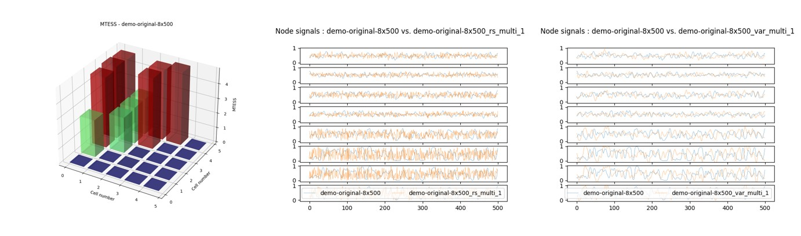
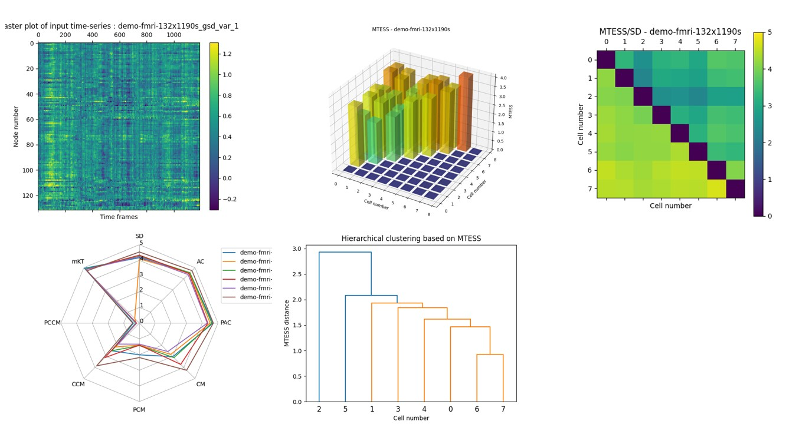

# GSDGM and MTESS Toolbox for Python
Group Surrogate Data Generating Model (GSDGM) and Multivariate Time-series Ensemble Similarity Score (MTESS) Toolbox for Python
(MATLAB version is [here](https://github.com/takuto-okuno-riken/mtess))

## Introduction
The GSDGM and MTESS Toolbox is a powerful tool for surrogate data generation and multivariate time-series similarity analysis.
One GSDGM algorithm has been implemented to generate group surrogate data: 1) Vector Auto-Regression (VAR) surrogate [(R. Liégeois, et al., 2017)](https://www.sciencedirect.com/science/article/abs/pii/S1053811917307516) for Python version ([MATLAB version](https://github.com/takuto-okuno-riken/mtess) implements three GSDGM algorithms).
The VAR surrogate tries to fit the common features of the whole data. Thus, the GSDGM approach has the very unique ability to generate group centroid multivariate time-series.
This allows us to achieve the most biologically plausible standardized human brain dynamics model based on a large human rs-fMRI dataset from [the Human Connectome Project](https://www.humanconnectome.org/).

MTESS can quantify the similarity between two multivariate time-series. It is composed of the normalized distance or cos-similarity of seven basic statistical properties. These are the standard deviation, auto-correlation, partial auto-correlation, correlation matrix, partial correlation matrix, cross-correlation matrix and partial cross-correlation matrix, and multivariate kurtosis. By considering each of these statistical properties, it is possible to identify which of them differ between two multivariate time-series using a “MTESS radar chart.”  The total difference between two multivariate time-series is expressed by a single value [0, 5] (0: not similar to 5: similar)(MTESS), and the  difference in each univariate time-series, which we consider as nodes of a network, is expressed as a Node MTESS value.

The combination of GSDGM and MTESS allows us to perform fingerprint analysis of a group of multivariate time-series.
The GSDGM can generate the group centroid time-series and MTESS can quantify normality and abnormality based on a comparison between the group centroid and each individual multivariate time-series.

<b>Command line tools</b>

| name | description |
|:---|:---|
| mtess | Calculate and plot MTESS for a group of multivariate time-series data. |
| gsdgm | Generate a group surrogate model (VAR surrogate) and (multivariate time-series) group surrogate data.|
| surrogate | Generate univariate and multivariate time-series surrogate data by Random Gaussian (RG), Random shuffling (RS), Fourier Transfor (FT), Amplitude Adjusted FT (AAFT)[(J.Theilear et al., 1992)](https://www.sciencedirect.com/science/article/abs/pii/016727899290102S), Iterated AAFT (IAAFT)[(T.Schreiber and A.Schmitz, 1996)](https://journals.aps.org/prl/abstract/10.1103/PhysRevLett.77.635), VAR surrogate.|
| surrotest | Hypothesis testing based on the monte-carlo method (Linearity test, Gaussian distribution test, Independent and Identically Distributed (I.I.D) test)  [(J.Theilear and D.Prichard, 1996)](https://www.sciencedirect.com/science/article/abs/pii/0167278996000504).|

## Requirements: software
* Python 3.9.*
* matplotlib 3.5.*
* scikit_learn 1.1.*
* h5py 3.8.*
* pandas 1.4.*
* statsmodels 0.14.*

## Installation
1. Download this [Toolbox](https://github.com/takuto-okuno-riken/gsdgmpy/archive/refs/heads/main.zip) zip files.
2. Extract zip file under your working directory <work_path>/gsdgmpy-main.
3. This is not required, but we recommend using the conda virtual environment.
~~~
(base) work_path>cd gsdgmpy-main
(base) gsdgmpy-main>conda create -n gsdgm python=3.9
...
(base) gsdgmpy-main>conda activate gsdgm
(gsdgm) gsdgmpy-main>
~~~
4. Install several packages.
~~~
(gsdgm) gsdgmpy-main>pip install -r requirements.txt
...
~~~
5. Run the following demos.

## Command Line Tools Demos
<b>Demo 1</b> 
The first demo shows the calculation of MTESS among time-series data and figure output. 
(Copy and paste this command line. Demo data is included in GSDGM and MTESS Toolbox.)
~~~
(gsdgm) gsdgmpy-main>python mtess.py --showinsig --showmat --showsig --showprop --shownode data/cx-8x500-demo-surrogate.mat
...
output mat file : results\cx-8x500-demo-surrogate_mtess.mat
~~~

This demo calculates MTESS and generates the following figures:

"--showinsig" option shows each multivariate time-series data. 
"--showmat" option shows MTESS matrix and statistical property matrix results. 
"--showsig" option shows comparison time-series plot between first data vs. others. 
"--showprop" option shows MTESS Polar chart result of first data vs. others. 
"--shownode" option shows Node MTESS result of first data vs. others. 
 
Finally, the "mtess" command saves the calculation result in either .mat or .csv format ("--format 0" option).

##
<b>Demo 2</b> 
The second demo shows the calculation of surrogate data, then the calculation of MTESS between original time-series data vs. surrogate data.
~~~
(gsdgm) gsdgmpy-main>python surrogate.py --rs --ft --aaft --var data/demo-original-8x500.csv
loading signals : data/demo-original-8x500.csv
var surrogate sample : 1
output mat file : results\demo-original-8x500_var_multi_all.mat
output mat file : results\demo-original-8x500_rs_multi_all.mat
output mat file : results\demo-original-8x500_ft_multi_all.mat
output mat file : results\demo-original-8x500_aaft_multi_all.mat

(gsdgm) gsdgmpy-main>python mtess.py --showmat --showprop --showsig data/demo-original-8x500.csv results/demo-original-8x500_rs_multi_all.mat results/demo-original-8x500_var_multi_all.mat results/demo-original-8x500_ft_multi_all.mat results/demo-original-8x500_aaft_multi_all.mat
...
output mat file : results\demo-original-8x500_mtess.mat
~~~
the "surrogate" command reads a single multivariate time-series (8x500) file and generates surrogate data (8x500) by (multivariate) RS surrogate, VAR surrogate, FT surrogate, and AAFT surrogate.
Then, the "mtess" command reads the original time-series .csv and surrogate time-series data .mat files, and calculates multivariate time-series similarity.

As can be seen in this result, VAR, FT and AAFT surrogate data (cell number 3-5) vs. original time-series data (cell number 1) shows a higher MTESS (similarity) than RS surrogate data (cell number 2) vs. original data.

##
<b>Demo 3</b> 
The third demo shows the calculation of (VAR) group surrogate data based on [the Human Connectome Project](https://www.humanconnectome.org/) S500 male rs-fMRI data (132 ROIs). Then MTESS is calculated amongst some samples of rs-fMRI time-series data and group surrogate data. 
(Caution: Downloading and MTESS calculation will take some time.)
~~~
(gsdgm) gsdgmpy-main>python gsdgm.py --surrnum 2 --showsig http://fmridata2.s323.xrea.com/hcp-s500m-var1.mat
downloading http://fmridata2.s323.xrea.com/hcp-s500m-var1.mat
save cache file : data/cache/fmridata2_s323_xrea_com-hcp-s500m-var1.mat
var surrogate sample : 1
var surrogate sample : 2
output mat file : results\fmridata2_s323_xrea_com-hcp-s500m-var1_gsd_var_all.mat

(gsdgm) gsdgmpy-main>python mtess.py --showmat --showdend ward --showprop --cache data/demo-fmri-132x1190s.mat results\fmridata2_s323_xrea_com-hcp-s500m-var1_gsd_var_all.mat
...
output mat file : results\demo-fmri-132x1190s_mtess.mat
~~~

As can be seen in this result, the VAR group surrogate data (cell number 6, 7) shows a higher MTESS than the sample rs-fMRI data (cell number 0-5).
This is because the downloaded data generating model (GSDGM) was created using a large set of HCP data (N=410) and can thus generate group representative (standard) human brain dynamics. This generated group surrogate data can be considered as the centroid of the group of original rs-fMRI time-series data.

Other GSDGM .mat files (male, female, algorithms) can be found in [Zenodo](https://zenodo.org/record/6381103).

##
<b>Demo 4</b> 
This demo shows creation of a data generating model (GSDGM) from sample rs-fMRI time-series data (132 ROIs). Then MTESS is calculated amongst the group of original time-series data and group surrogate data. 
(Caution: MTESS calculation will take a time.)
~~~
(gsdgm) gsdgmpy-main>python gsdgm.py --var --lag 1 --surrnum 2 --showsig --showras data/demo-fmri-132x1190s.mat
output group surrogate model file : results\demo-fmri-132x1190s_gsm_var.mat
var surrogate sample : 1
var surrogate sample : 2
output mat file : results\demo-fmri-132x1190s_gsd_var_all.mat

(gsdgm) gsdgmpy-main>python mtess.py --showmat --showprop --showdend ward --cache data/demo-fmri-132x1190s.mat results/demo-fmri-132x1190s_gsd_var_all.mat
...
start to calc ccm ... done t=1.137007
start to calc pccm ... done t=21.706379
save cache of results/cache\mtess-demo-fmri-132x1190s_gsd_var_2-132x1190d100c8p8.mat
...
output mat file : results\demo-fmri-132x1190s_mtess.mat
~~~

As can be seen in this result, VAR group surrogate data (cell number 6,7) shows a higher MTESS than the original data (cell number 0-5).
From hierarchical clustering it can be seen that the group surrogate data is the representative centroid of the group of original time-series data.

##
<b>Demo 5</b> 

Linearity test: 
1. Use FT or AAFT surrogate ("surrogate --ft" or "--aaft" command) to generate 399 surrogate data samples from the original time-series file.
2. Use the "--l" option of the "surrotest" command for carrying out a linearity test. The original time-series and surrogate data files must be specified for this command.
~~~
(gsdgm) gsdgmpy-main>python surrogate.py --ft --surrnum 399 data/demo-original-8x500.csv
loading signals : data/demo-original-8x500.csv
output mat file : results\demo-original-8x500_ft_multi_all.mat

(gsdgm) gsdgmpy-main>python surrotest.py --l --showsig --showrank data/demo-original-8x500.csv results/demo-original-8x500_ft_multi_all.mat
...
significantly not linear (1 / 8)
output mat file : results\demo-original-8x500_linear_test.mat
~~~
The plot design for the linearity test was inspired by [J.Theilear and D.Prichard (1996)](https://www.sciencedirect.com/science/article/abs/pii/0167278996000504).

Gaussian distribution test: 
1. Use RG surrogate ("surrogate --rg" command) to generate 399 of surrogate data samples from the original time-series file.
2. Use the "--g" option of the "surrotest" command for Gaussian distribution test. The original time-series and surrogate data files must be specified for this command.
~~~
(gsdgm) gsdgmpy-main>python surrogate.py --rg --surrnum 399 data/demo-original-8x500.csv
loading signals : data/demo-original-8x500.csv
output mat file : results\demo-original-8x500_rg_multi_all.mat

(gsdgm) gsdgmpy-main>python surrotest.py --g --showsig --showrank data/demo-original-8x500.csv results/demo-original-8x500_rg_multi_all.mat
...
significantly not gaussian distribution (5 / 8)
output mat file : results\demo-original-8x500_gaussian_test.mat
~~~

Independent and Identically Distributed (I.I.D) test: 
1. Use RS surrogate ("surrogate --rs" command) to generate 399 of surrogate data samples from the original time-series file.
2. Use the "--i" option of the "surrotest" command for I.I.D test. The original time-series and surrogate data files must be specified for this command.
~~~
(gsdgm) gsdgmpy-main>python surrogate.py --rs --surrnum 399 data/demo-original-8x500.csv
loading signals : data/demo-original-8x500.csv
output mat file : results\demo-original-8x500_rs_multi_all.mat

(gsdgm) gsdgmpy-main>python surrotest.py --i --showsig --showrank data/demo-original-8x500.csv results/demo-original-8x500_rs_multi_all.mat
...
significantly not I.I.D. (8 / 8)
output mat file : results\demo-original-8x500_iid_test.mat
~~~

## Command Line Tools Reference
<b>mtess command</b> 
~~~
(gsdgm) gsdgmpy-main>python mtess.py -h
usage: mtess.py [-h] [--range RANGE] [--aclag ACLAG] [--cclag CCLAG] [--pcclag PCCLAG] [--outpath OUTPATH]
                [--format FORMAT] [--transform TRANSFORM] [--transopt TRANSOPT] [--showinsig] [--showinras]
                [--showmat] [--showsig] [--showprop] [--shownode] [--showdend SHOWDEND] [--cache]
                [--cachepath CACHEPATH]
                filename [filename ...]

positional arguments:
  filename              filename of node status time-series (node x frames)

optional arguments:
  -h, --help            show this help message and exit
  --range RANGE         input group value range (default:"auto", sigma:<num>, full:<num> or <min>:<max>)
  --aclag ACLAG         time lag <num> for Auto Correlation (default:15)
  --cclag CCLAG         time lag <num> for Cross Correlation (default:8)
  --pcclag PCCLAG       time lag <num> for Partial Cross Correlation (default:8)
  --outpath OUTPATH     output files path (default:"results")
  --format FORMAT       save file format <type> 0:csv, 1:mat (default:1)
  --transform TRANSFORM
                        input signal transform 0:raw, 1:sigmoid (default:0)
  --transopt TRANSOPT   signal transform option (for type 1:centroid value)
  --showinsig           show input time-series data of <filename>.csv
  --showinras           show raster plot of input time-series data of <filename>.csv
  --showmat             show result MTESS matrix
  --showsig             show 1 vs. others node signals
  --showprop            show result polar chart of 1 vs. others MTESS statistical properties
  --shownode            show result line plot of 1 vs. others node MTESS
  --showdend SHOWDEND   show dendrogram of <algo> hierarchical clustering based on MTESS matrix.
  --cache               use cache file for MTESS calculation
  --cachepath CACHEPATH
                        cache files <path> (default:"results/cache")
~~~
The input .mat file should include input cell data. The node count must be the same within the group, whereas time-series length does not have to be the same.
| name | cell | description |
|:---|:---|:---|
|CX |{&lt;nodes&gt; x &lt;length&gt;} x &lt;cell number&gt; |group of multivariate time-series|
|names |{'data name string'} x &lt;cell number&gt; |names of each time-series data|

The output .mat file includes the following matrix data:

| name | matrix | description |
|:---|:---|:---|
|MTS |&lt;cell number&gt; x &lt;cell number&gt; | MTESS matrix (2D)|
|MTSp |&lt;cell number&gt; x &lt;cell number&gt; x 7| MTESS statistical property matrix (3D)|
|nMTS |&lt;cell number&gt; x &lt;cell number&gt; x &lt;nodes&gt;| Node MTESS matrix (3D)|
|nMTSp |&lt;cell number&gt; x &lt;cell number&gt; x &lt;nodes&gt; x 7| Node MTESS statistical property matrix (4D)|

Similarities are generated for the following 7 statistical properties: mean, standard deviation, DFT amplitude, correlation, partial correlation, cross-correlation and partial cross-correlation.

##
<b>gsdgm command</b> 
~~~
(gsdgm) gsdgmpy-main>python gsdgm.py -h
usage: gsdgm.py [-h] [--var] [--lag LAG] [--noise NOISE] [--outpath OUTPATH] [--transform TRANSFORM]
                [--transopt TRANSOPT] [--format FORMAT] [--surrnum SURRNUM] [--siglen SIGLEN] [--range RANGE]
                [--showinsig] [--showinras] [--showsig] [--showras]
                filename [filename ...]

positional arguments:
  filename              filename of node status time-series (node x frames)

optional arguments:
  -h, --help            show this help message and exit
  --var                 output Vector Auto-Regression (VAR) group surrogate model (<filename>_gsm_var.mat)
  --lag LAG             time lag <num> for VAR (default:3)
  --noise NOISE         noise type for VAR surrogate model (default:"gaussian" or "residuals")
  --outpath OUTPATH     output files path (default:"results")
  --transform TRANSFORM
                        input signal transform 0:raw, 1:sigmoid (default:0)
  --transopt TRANSOPT   signal transform option (for type 1:centroid value)
  --format FORMAT       save file format <type> 0:csv, 1:mat(each), 2:mat(all) (default:2)
  --surrnum SURRNUM     output surrogate sample number <num> (default:1)
  --siglen SIGLEN       output time-series length <num> (default:same as input time-series)
  --range RANGE         output surrogate value range (default:"auto", sigma:<num>, full:<num>, <min>:<max> or "none")
  --showinsig           show input time-series data of <filename>.csv
  --showinras           show raster plot of input time-series data of <filename>.csv
  --showsig             show output surrogate time-series data
  --showras             show raster plot of output surrogate time-series data
~~~
The input .mat file should include input cell data described as follows. The node count must be the same within the group, whereas the time-series length does not have to be the same.
| name | cell | description |
|:---|:---|:---|
|CX |{&lt;nodes&gt; x &lt;length&gt;} x &lt;cell number&gt; |group of multivariate time-series|
|names |{'data name string'} x &lt;cell number&gt; |names of each time-series data|

The output (group surrogate model) .mat file includes the following struct data:

| name | type | description |
|:---|:---|:---|
|net | struct |struct of group surrogate model|
|gRange | struct |struct of group range information|
|name | string |name of group surrogate model|

The output (group surrogate data) .mat file includes the following cell data:

| name | cell | description |
|:---|:---|:---|
|CX |{&lt;nodes&gt; x &lt;length&gt;} x &lt;cell number&gt; |group of multivariate time-series|
|names |{'data name string'} x &lt;cell number&gt; |names of each time-series data|

##
<b>surrogate command</b> 
~~~
(gsdgm) gsdgmpy-main>python surrogate.py -h
usage: surrogate.py [-h] [--rg] [--rs] [--ft] [--aaft] [--iaaft] [--var] [--multi] [--uni] [--noise NOISE]
                    [--surrnum SURRNUM] [--outpath OUTPATH] [--format FORMAT] [--transform TRANSFORM]
                    [--transopt TRANSOPT] [--lag LAG] [--showsig]
                    filename [filename ...]

positional arguments:
  filename              filename of node status time-series (node x frames)

optional arguments:
  -h, --help            show this help message and exit
  --rg                  output Random Gaussian (RG) surrogate (<filename>_rg_<variate>_<num>.csv)
  --rs                  output Random Shuffling (RS) surrogate (<filename>_rs_<variate>_<num>.csv)
  --ft                  output Fourier Transform (FT) surrogate (<filename>_ft_<variate>_<num>.csv)
  --aaft                output Amplitude Adjusted FT (AAFT) surrogate (<filename>_aaft_<variate>_<num>.csv)
  --iaaft               output Iterated AAFT (IAAFT) surrogate (<filename>_iaaft_<variate>_<num>.csv)
  --var                 output Vector Auto-Regression (VAR) surrogate (<filename>_var_<variate>_<num>.csv)
  --multi               output multivariate surrogate (default:on)
  --uni                 output univariate surrogate (default:off)
  --noise NOISE         noise type for VAR surrogate (default:"gaussian")
  --surrnum SURRNUM     output surrogate sample number <num> (default:1)
  --outpath OUTPATH     output files path (default:"results")
  --format FORMAT       save file format <type> 0:csv, 1:mat(each), 2:mat(all) (default:2)
  --transform TRANSFORM
                        input signal transform 0:raw, 1:sigmoid (default:0)
  --transopt TRANSOPT   signal transform option (for type 1:centroid value)
  --lag LAG             time lag <num> for VAR (default:3)
  --showsig             show input time-series data of <filename>.csv
~~~
The input .csv or .mat file should include time-series matrix data in the following format:
| name | matrix | description |
|:---|:---|:---|
|X |&lt;nodes&gt; x &lt;length&gt; | multivariate time-series|

The output (surrogate data) .mat file includes the following cell data:

| name | cell | description |
|:---|:---|:---|
|CX |{&lt;nodes&gt; x &lt;length&gt;} x &lt;cell number&gt; |group of multivariate time-series|
|names |{'data name string'} x &lt;cell number&gt; |names of each time-series data|

##
<b>surrotest command</b> 
~~~
(gsdgm) gsdgmpy-main>python surrotest.py -h
usage: surrotest.py [-h] [--g] [--l] [--i] [--side SIDE] [--outpath OUTPATH] [--format FORMAT] [--showsig]
                    [--showrank]
                    filename [filename ...]

positional arguments:
  filename           filename of node status time-series (node x frames)

optional arguments:
  -h, --help         show this help message and exit
  --g                output Gaussian distribution test (<original>_gauss_test.csv)
  --l                output Linearity test (<original>_linear_test.csv)
  --i                output I.I.D test (<original>_iid_test.csv)
  --side SIDE        bottom-side(1), both-side(2), top-side(3) (default:2)
  --outpath OUTPATH  output files path (default:"results")
  --format FORMAT    save file format <type> 0:csv, 1:mat (default:1)
  --showsig          show input time-series data of <filename>.csv
  --showrank         show raster plot of input time-series data of <filename>.csv
~~~
The input .mat file should include input cell data described as follows. The node count must be the same within the group.
| name | cell | description |
|:---|:---|:---|
|CX |{&lt;nodes&gt; x &lt;length&gt;} x &lt;cell number&gt; |group of multivariate time-series|
|names |{'data name string'} x &lt;cell number&gt; |names of each time-series data|

The output .mat file includes the following matrix data:

| name | matrix | description |
|:---|:---|:---|
|P |&lt;nodes&gt; x 1 | P-value result|
|Rank |&lt;nodes&gt; x 1 | Rank value result |

## Citing GSDGM and MTESS Toolbox
If you find GSDGM and MTESS Toolbox useful in your research, please cite it as follows: 

Takuto Okuno, Junichi Hata, Yawara Haga, Kanako Muta, Hiromichi Tsukada, Ken Nakae, Hideyuki Okano, Alexander Woodward,
["Group Surrogate Data Generating Models and Similarity Quantifiation of Multivariate Time-Series: A Resting-State fMRI Study"](https://www.yahoo.com/), work in progress.

